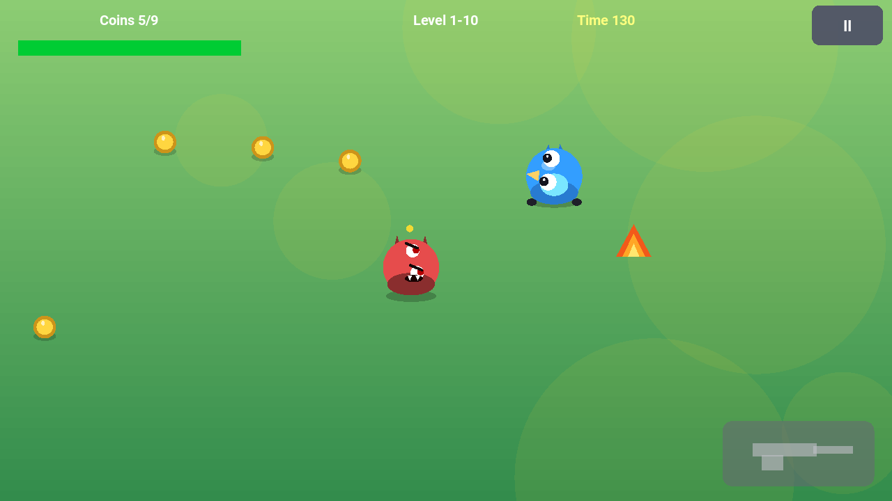
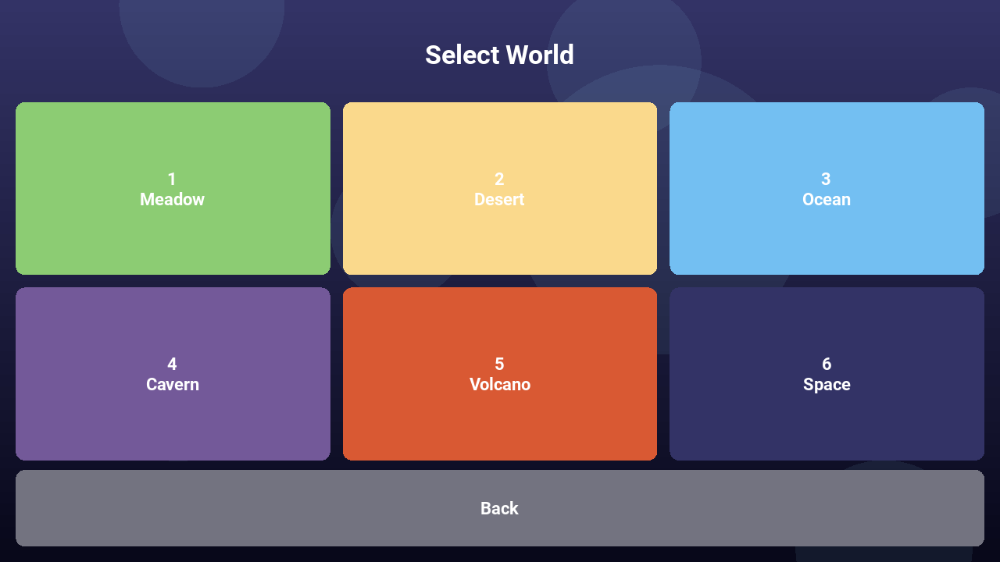
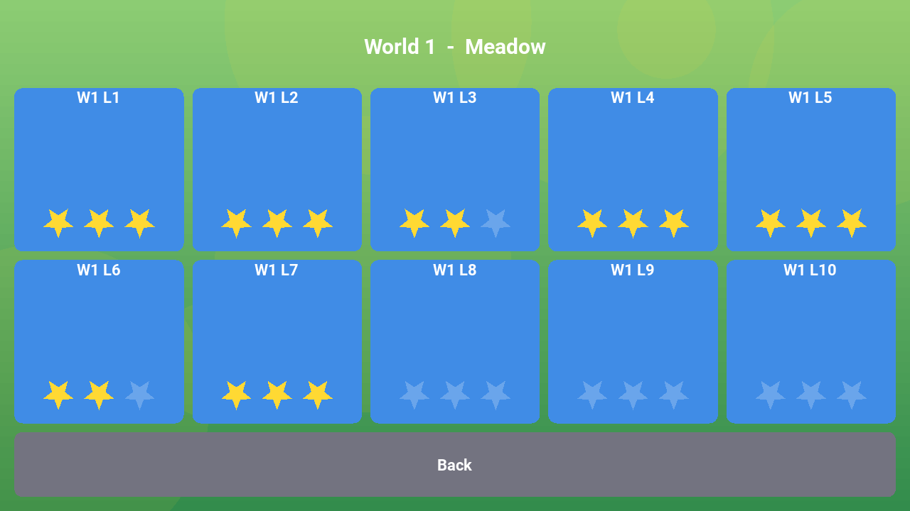
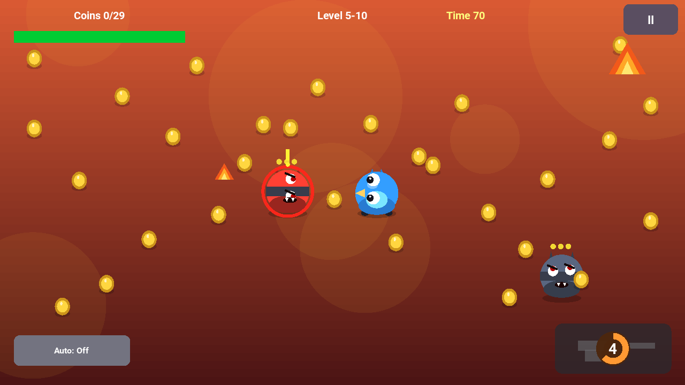
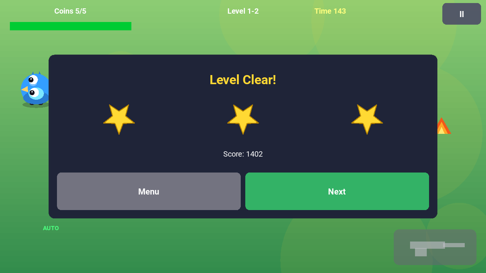
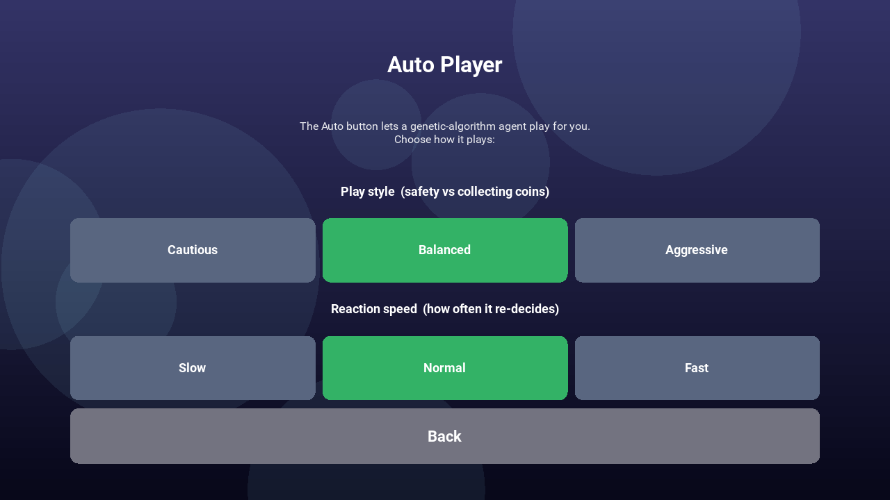
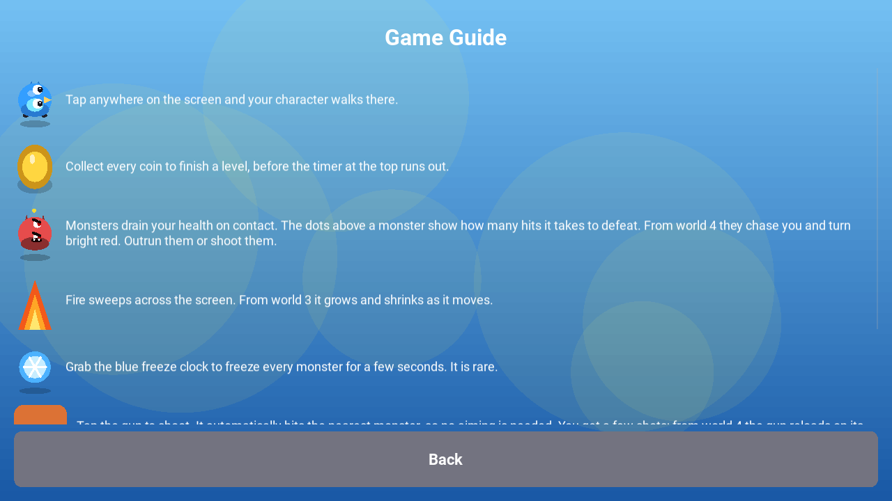
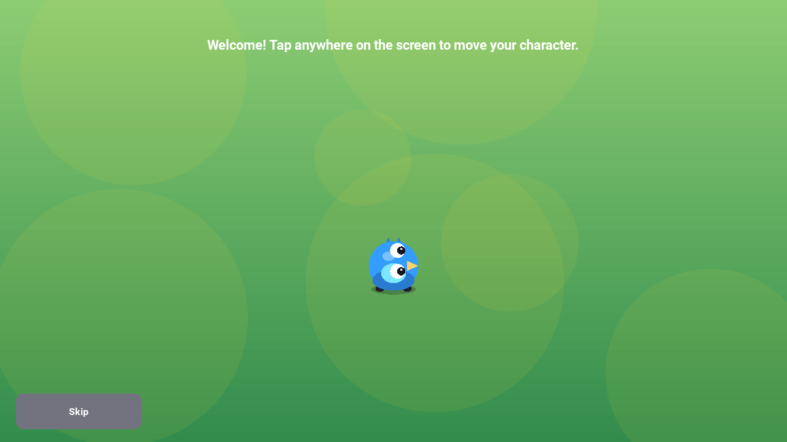

# CoinTex

CoinTex is a top down arcade game written entirely in Python with the [Kivy](https://kivy.org) framework. You move a character around each level to collect all the coins before the timer runs out, while dodging monsters and fire and shooting your way through. It runs from the same code on Windows, Linux, macOS, Android and iPhone.

Every screen, all of the graphics and all of the sound are generated in code, so the project has no image or audio asset files to ship beyond a handful of short sounds.

<p align="center">
  
</p>

## Contents

- [Get the game](#get-the-game)
- [How to play](#how-to-play)
- [Worlds](#worlds)
- [Auto Player (a genetic algorithm plays for you)](#auto-player-a-genetic-algorithm-plays-for-you)
- [Multiplayer](#multiplayer)
- [Screenshots](#screenshots)
- [Run from source](#run-from-source)
- [Build the apps](#build-the-apps)
- [Project layout](#project-layout)
- [Learning resources](#learning-resources)
- [Author](#author)

## Get the game

### Android

CoinTex is on Google Play: https://play.google.com/store/apps/details?id=coin.tex.cointexreactfast

### iPhone

There is no App Store listing yet. You can build the iPhone app yourself for free with GitHub Actions and install it on your phone. See [IOS_BUILD_WORKFLOW.md](IOS_BUILD_WORKFLOW.md) to produce the app file and [IOS_INSTALL.md](IOS_INSTALL.md) to install it on an iPhone.

### Windows, Linux and macOS

Run the game from source. See [Run from source](#run-from-source) below.

## How to play

The goal of every level is to collect all the coins before the timer at the top runs out.

- Tap anywhere on the screen and your character walks there.
- Collect every coin to finish the level and unlock the next one.
- Your health bar is at the top left. Touching a monster or fire drains it. When it reaches zero you lose the level.
- Finish a level with more health left to earn up to 3 stars.

The hazards you meet:

- Monsters drain your health on contact. The dots above a monster show how many hits it takes to defeat. From world 4 some monsters chase you and turn bright red, so you have to outrun them or shoot them.
- Fire sweeps across the screen. From world 3 it grows and shrinks as it moves, so the safe gap keeps changing.
- A blue freeze clock shows up rarely. Grab it to freeze every monster for a few seconds.

Your gun:

- Tap the gun button to shoot. It aims at the nearest monster on its own, so you never have to aim.
- You have a few shots. From world 4 the gun reloads by itself, with a countdown shown on the gun button.

A short interactive tutorial runs the first time you play, and you can replay it any time from the main menu with "How to play". The "Guide" screen lists every element with the same icons used in the game.

## Worlds

There are 6 worlds with 10 levels each, 60 levels in total. Every level is timed. Instead of getting harder by crowding the screen with more enemies, each world turns up the behaviour of the few on screen, so the game stays smooth on a phone.

1. Meadow: the basics, gentle pace.
2. Desert: enemies move faster.
3. Ocean: fire grows and shrinks as it moves.
4. Cavern: monsters start chasing you, and your gun reloads on its own.
5. Volcano: contact hurts more and the pace climbs.
6. Space: everything at its hardest.

## Auto Player (a genetic algorithm plays for you)

Tap the Auto button during a level and a small genetic algorithm takes over. It steers toward coins while keeping clear of monsters and fire, shoots chasers and races the timer. Tap Auto again to take back control.

You can tune how it plays from Settings, then Auto Player:

- Play style: Cautious, Balanced or Aggressive (safety versus collecting coins).
- Reaction speed: Slow, Normal or Fast (how often it re-decides).

The agent is plain Python and adds no extra dependencies, so it ships inside the app on every platform. A separate, research oriented version that searches with [PyGAD](https://github.com/ahmedfgad/GeneticAlgorithmPython) lives in the `PlayerGA` folder.

## Multiplayer

Two people can play together over the network. From the main menu open Multiplayer, then one player taps Host Game and the other taps Join Game. The host picks the game type and its device shows an address; the joining player types that address to connect. Both then play in the same arena.

There are two game types, chosen by the host. In Co-op you share one goal and clear all the coins together before the timer runs out. In Versus you race for the same coins and whoever collects the most wins.

The Host screen shows two addresses. The same-Wi-Fi address (like 192.168.x.x) is for two devices on the same network and needs no setup. The internet address is the host's public IP; to use it the host must forward TCP port 50007 on their router to their device, because the connection is made straight to the host. The joining player types whichever address fits, into the same field. The networking uses only the Python standard library, so it adds no extra packages to the build.

## Screenshots

<table>
  <tr>
    <td align="center">
      <br>Select a world
    </td>
    <td align="center">
      <br>Pick a level and see your stars
    </td>
  </tr>
  <tr>
    <td align="center">
      <br>A chasing monster and the reloading gun
    </td>
    <td align="center">
      <br>Level cleared with a star rating
    </td>
  </tr>
  <tr>
    <td align="center">
      <br>Auto Player settings
    </td>
    <td align="center">
      <br>In game guide
    </td>
  </tr>
  <tr>
    <td align="center">
      <br>Interactive tutorial
    </td>
    <td align="center">
      <br>Collecting coins in the Meadow
    </td>
  </tr>
</table>

## Run from source

You need Python 3.9 or newer. The game was developed on Python 3.12 with Kivy 2.3.

```
git clone https://github.com/ahmedfgad/CoinTex.git
cd CoinTex
python -m pip install -r requirements.txt
python main.py
```

On Linux you can instead run `./setup_venv.sh`, which creates a virtual environment and installs Kivy and the desktop libraries it needs. It also sets up the Android build tools, so use it if you plan to build the Android app as well.

If you run the game on a machine with no audio output, such as some virtual machines, start it with `SDL_AUDIODRIVER=dummy python main.py` so the audio backend does not block.

## Build the apps

### Android

The Android app is built with [Buildozer](https://github.com/kivy/buildozer) using the settings in `buildozer.spec`. The helper script builds the signed release files:

```
./build_android.sh
```

It produces an `.aab` for Google Play and an `.apk` for testing in the `bin` folder. Signing the release is described in [SIGNING.md](SIGNING.md).

### iPhone

iOS apps must be built on a Mac. You do not need to own one: the GitHub Actions workflow at `.github/workflows/ios-build.yml` builds the app on a free macOS runner and gives you the files to install. See [IOS_BUILD_WORKFLOW.md](IOS_BUILD_WORKFLOW.md). If you do have a Mac, the `build_ios.sh` script builds the Xcode project locally.

### Desktop (Windows, Linux, macOS)

`build_desktop.sh` packages the game into a standalone program with [PyInstaller](https://pyinstaller.org). PyInstaller builds for the system it runs on, so run it on each target:

```
./build_desktop.sh            # one standalone file in dist/
./build_desktop.sh --onedir   # a folder that starts faster
```

On Windows, run it inside Git Bash or MSYS2 to get `dist\CoinTex.exe`. On Linux you get `dist/CoinTex` and on macOS `dist/CoinTex.app`. A Windows `.exe` cannot be built from Linux, since PyInstaller does not cross build.

## Project layout

| Path | What it is |
| --- | --- |
| `main.py` | The app and the gameplay screen. |
| `levels.py` | The 60 levels and how each world scales in difficulty. |
| `graphics.py` | All sprites and effects, drawn in code on the Kivy canvas. |
| `ui.py` | Menus, settings, tutorial, guide and the Auto Player screen. |
| `audio.py` | Music and sound effects. |
| `state.py` | Saved progress and settings. |
| `autoplay.py` | The in game genetic algorithm Auto Player. |
| `tools/` | Scripts that generate the sounds and render the sprite preview. |
| `PlayerGA/` | The research version of the player that searches with PyGAD. |
| `cointex_media/` | Screenshots and the promo video. |

## Learning resources

CoinTex started as the example game for learning Kivy and Android packaging. The following cover the original version of the game and are a good way to learn how a Kivy game is built and turned into an Android app.

- Tutorial: [Python for Android: Start Building Kivy Cross-Platform Applications](https://www.linkedin.com/pulse/python-android-start-building-kivy-cross-platform-applications-gad)
- Book: [Building Android Apps in Python Using Kivy with Android Studio](https://www.amazon.com/Building-Android-Python-Using-Studio/dp/1484250303), which documents CoinTex in chapters 5 and 6.

## Author

Ahmed Fawzy Gad

- Email: [ahmed.f.gad@gmail.com](mailto:ahmed.f.gad@gmail.com)
- LinkedIn: [linkedin.com/in/ahmedfgad](https://www.linkedin.com/in/ahmedfgad)
- GitHub: [github.com/ahmedfgad](https://github.com/ahmedfgad)
- Amazon author page: [amazon.com/author/ahmedgad](https://amazon.com/author/ahmedgad)
